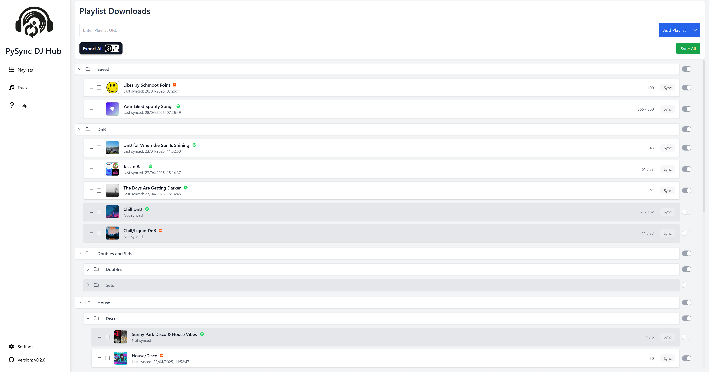
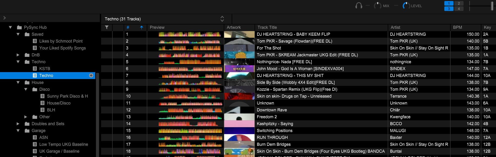

    

<b>PySync DJ Hub</b>

<h2> Automated DJ Music Library Manager Tool

PySync DJ Hub is a desktop app that allows you to seamlessly sync your playlists from multiple music platforms to your Rekordbox library, currently supports Spotify, Soundcloud, and soon Youtube.

    

 

### **Ethos:** 
This app is built with the hope that more people take up DJing and more people get into dance music. Having music to play is often a barrier to entry for this. All audio sourced from publicly available sources, such as youtube. Hence, the quality of audio downloaded by this app is capped at a lower quality. **Please buy the music your love and support the artists for full quality tracks. The dance music scene is dying, and it needs everyone's support.**

### **Features:**
- Seamless automated syncing of playlists between platforms such as SoundCloud and Spotify.
- Easily export playlists into Rekordbox.
- Organise your playlists with folders and a intuitive drag and drop interface.
- Intelligent downloads avoids duplicate track downloads saving storage space and time.   
- Standalone desktop app or in browser interface.

### **How it works:** 
The program has three main stages: 
1. The first, adding playlists. This step involves querying the music platforms API's for your playlists information and adding them to the local database. 
2. The second stage is syncing the playlists. This step involves downloading the tracks from public sources, such as YouTube, using a Python library called yt-dlp. 
3. The final stage is exporting the playlists to Rekordbox. This step involves generating an iTunes XML file that can be imported into Rekordbox.  

### **Technical Details:** 
This app is built with Flask (Python) backend, React (Javascript) frontend, and a SQLite database. It has been bundled with Electron js to allow it to be run on desktop. Read more here [Technical Details](docs/TechnicalReadme.md)

# Demo

Demonstration of the a simple user flow: Adding a playlist, dragging and dropping in the right folder, syncing and downloading the playlist, before lastly exporting to Rekordbox. 

<video controls src="docs/PySync Hub Demo.mp4" title="Title"></video>

The exported playlists then visible in Rekordbox: 

# Getting Started

## Installation & Updating

See Install and Update guide here: [Install](docs/Install.md)

## How To Use

See the Help Page for all usage instructions: [Help](docs/Help.md)

## Troubleshooting
If you are having trouble with the app, please check the [Troubleshooting Section](docs/Help.md#troubleshooting) for common issues and solutions.

