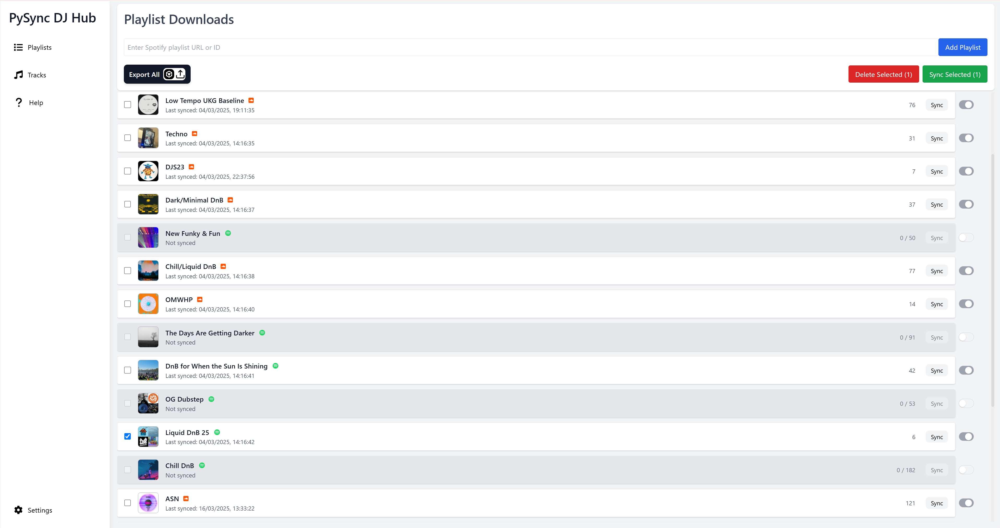

⚠️ WIP, POC stage

PySync Hub is a successor to PySync DJ, now expanded to a full React UI, Flask Backend, with a SQLite database.

As well as Spotify integration, PySync now had soundcloud and youtube support.

**More To Come!..**

# PySync DJ Hub

PySync DJ Hub is a desktop app that allows you to seamlessly sync your playlists from multiple music platforms to your Rekordbox library. It supports currently supports Spotify, Soundcloud, and soon Youtube.

    

**Ethos:** This app is built with the hope that more people take up DJing and get more people get into dance music. The quality of audio downloaded by this app is capped at 128kbps and all audio sourced from publicly available sources. **Please buy the music you love and support the artists. The music scene is dying, and it needs everyone's support.**

**How it works:** The program has three main stages. The first, adding playlists. This step involves querying the music platforms API's for your playlists information and adding them to the local database. The second stage is syncing the playlists. This step involves downloading the tracks from public sources, such as YouTube, using a Python library called yt-dlp. The final stage is exporting the playlists to Rekordbox. This step involves generating an iTunes XML file that can be imported into Rekordbox.  

**Technical Details:** This app is built with Flask (Python) backend, React (Javascript) frontend, and a SQLite database. It has been bundled with Electron js to allow it to be run on desktop. Read more here [Technical Details](docs/TechnicalReadme.md)

# Getting Started

## API Keys
To be able to connect with the music platforms with this app, you will need to get api keys for each platform.
### Spotify
You can get a Spotify API key by going to the [Spotify Developer Dashboard](https://developer.spotify.com/dashboard/applications) and creating a new app. Once you have created the app, you will be able to get the client id and client secret.
### Soundcloud
You can get a Soundcloud API key by following the instructions here [SoundCloud API Key Tutorial](docs/Help.md).

## Installation
1. Go to the releases and download the release relevant to your operating system.
2. Extract the zip file to a location of your choice. A folder called "Pysync Hub" on your desktop or usb is recommended.
3. Open the folder and run the executable file. The location of which is /dist/PySync-Hub-platform/PySync-Hub.exe
4. Go to the settings page and enter your api keys.

## Exporting To Rekordbox
Once your playlists are synced, you can then export them to Rekordbox. To do this, click the export button on the main playlist page. This will generate a `rekordbox.xml` in the `rekordbox_library_exports` folder file which you can import to rekordbox like an itunes_library_file.xml, in Rekordbox Advanced Settings. Once the file is added, the PySync-Hub folder will be avalable in the library section under iTunes.

## Troubleshooting
If you are having trouble with the app, please check the [troubleshooting page](docs/Troubleshooting.md) for common issues and solutions.

