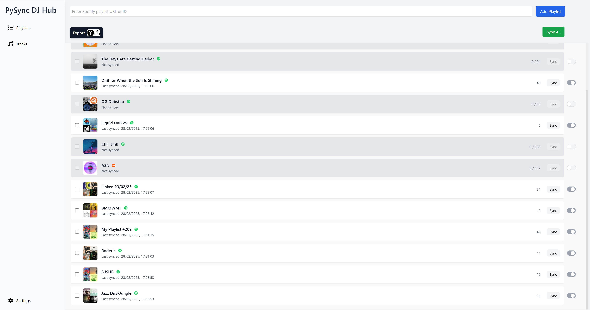

⚠️ WIP, POC stage

PySync Hub is a successor to PySync DJ, now expanded to a full React UI, Flask Backend, with a SQLite database.

As well as Spotify integration, PySync now had soundcloud and youtube support.

**More To Come!**

Preview Image:

