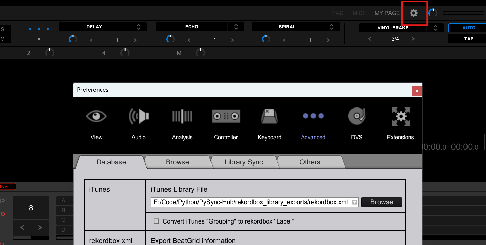
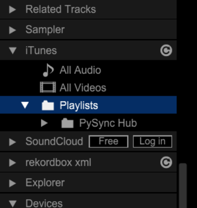

# Help

This page will go over how to use this software as well as some common issues and how to fix them. Read the whole page for some useful tips and instructions.

## Three Stage Software:

The program consists of three primary stages: adding playlists, downloading the audio files, and exporting you library to Rekordbox.

## 1. Adding Playlists:

Make sure you have set you API keys in `settings.py` before running the program. Without them the software cannot communicate with the relevant platform. You can get these keys by following the instructions in the instructions in the [Getting Started](../Readme.md#getting-started) guide.

To add a playlist, get the url of the playlist you want to add and paste it into the input box on the home page. The software will then communicate with the platform for the playlist information and keep it in a local database.
Once added you will see, from left to right, a select box, the playlist image, the name, platform and sync status of the playlist. On the right you will see a downloaded/total track count. Then a Sync Playlist Button. Lastly a toggle playlist display button. Disabled playlists are not downloaded or added to the exported rekordbox file.

Playlists urls can look like:
```
https://open.spotify.com/playlist/1sbpRux2JYEvosuikC01AY
https://soundcloud.com/schmoot-point/sets/chill-liquid-dnb
```
Soundcloud users liked songs can be added: 
```
https://soundcloud.com/subfocus/likes                               
```
And Spotify can be a users liked songs can also be added:
```
https://open.spotify.com/collection/tracks
```
**Note** that the program will open a new window for you to temporarily sign in through spotify to grant access to view your liked songs, which is private otherwise.

Once playlists are added you can click into them and see their tracks. From there you can view and modify track information such as audio source url and file location.

## 2. Syncing/Download Playlists:

Once playlist are added they can be synced (i.e downloaded). This will get the up to date playlist infomation and then add the playlist to a queue to be downloaded in the background. The download bar displays progress along side the downloaded count.
Playlist are saved to a `/music_downloads` folder in the root of the program. **Note:** moving them from this folder will break the link between the program and the file causing the program to redownload the file.

## 3. Exporting To Rekordbox:

When exporting to Rekordbox, the program will generate a `rekordbox.xml` file in the `rekordbox_library_exports` folder. 
This file is imported to Rekordbox in Rekordbox Advanced Settings.

<div align="center">
    
</div>

Once the file is added, the PySync-Hub folder will be available in the library section under iTunes. From there PySync Hub can be imported into your own library
<div align="center">
    
</div>

Enjoy!


# Tips and Hints
### Track and Date Limits
You can limit how many tracks are downloaded, this is paticularly useful for liked songs. You can set these limits as a date limit, tracks up to that date. Or track limit, the number of tracks to download. This can be accessed by the dropdown arrow when adding playlists or on the playlist page under options.

# Troubleshooting 

## Troubleshooting Adding Playlists

### 401 Unauthorized Error
1. Make sure you have set your API keys in `settings.py` before running the program. Without them the software cannot communicate with the relevant platform. You can get these keys by following the instructions in the instructions in the [Getting Started](../Readme.md#getting-started) guide.
2. Disconnect from any VPNs or proxies you may be using. 
3. If you are downloading a private spotify playlist, make sure you have logged in.
4. If you are downloading a soundcloud playlist, its possible that the app my need updating. Go to the [GitHub Page](https://github.com/Peter-SB/PySync-Hub)

## Troubleshooting Installing

### 1. Antivirus 