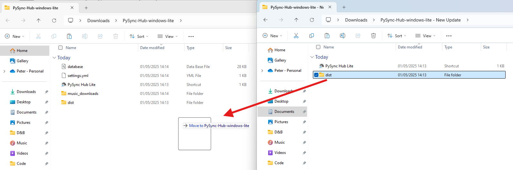

# How To Install

## 1. Download  
First choose which version you need to download. Pick either Windows or Mac. Then lite version or desktop.

The download can be found at [Releases](https://github.com/Peter-SB/PySync-Hub/releases) under Assets. 

### Lite VS Desktop?
**The Desktop** version is a full standalone desktop app that will run like a normal software with its own application window. (This can mean it takes a little longer to download or startup.)

**The Lite** version will run in your browser (e.g Chrome, Firefox etc). It is faster and takes up less space but looks less flashy.

## 2. Extract 
Once downloaded, extract the .zip to a folder e.g "`PySync-Hub`". This folder can be put on your usb or desktop for example. 

## 3. Run
Either **run the shortcut** or go to application directly in the correct folder in `/dist`. \( e.g `/dist/PySync-Hub-win32-x64` or `/dist/pysync-hub-lite`.)

## Troubleshooting
**Windows protected your PC** Click "More info" and then "Run anyway"

**Anti Virus** You may need to check your antivirus settings if you have an overzealous software like Norton

**Port Issues** The backend runs on port 5000 which may cause problems if you have other apps running on that port.

# How To Get API Keys

To be able to connect with the music platforms with this app, you will need to get api keys for each platform.

### Spotify
You can get a Spotify API key by going to the [Spotify Developer Dashboard](https://developer.spotify.com/dashboard/applications) and creating a new app. Once you have created the app, you will be able to get the client id and client secret.

You must set a Redirect URLs if you wish to sync liked songs or a private playlist. Your dashboard should look like this:

    

 

### Soundcloud

The Soundcloud API key can be simply found:
1. Opening incognito.
2. Developer Tools and going to the Network Tab (`ctr+shift+i`)
3. Going to Soundcloud.com
4. Use `ctr+f` to find the `client_id`.
5. Save this in your settings. 

 

    

 

# How To Update

Similar to installing Go to [Releases](https://github.com/Peter-SB/PySync-Hub/releases) and download the correct version.

Then just copy the contents of the new download into your PySync Hub Folder.

    

